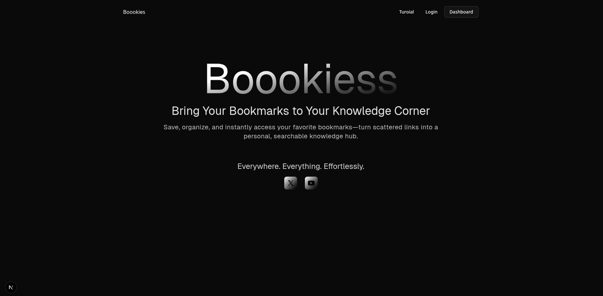

# Boookies

A Next.js-based book management application built with modern web technologies.

## Project Progress



## Getting Started

### Prerequisites

- Node.js 18+ installed on your machine
- npm, yarn, pnpm, or bun package manager

### How to Start the Server

1. **Clone the repository** (if you haven't already):

   ```bash
   git clone <repository-url>
   cd boookies
   ```

2. **Install dependencies**:

   ```bash
   npm install
   # or
   yarn install
   # or
   pnpm install
   # or
   bun install
   ```

3. **Run the development server**:

   ```bash
   npm run dev
   # or
   yarn dev
   # or
   pnpm dev
   # or
   bun dev
   ```

4. **Open your browser** and navigate to [http://localhost:3000](http://localhost:3000) to see the application.

The page auto-updates as you edit the files during development.

## Project Status

### What's Done So Far ✅

- [x] Initial Next.js project setup with TypeScript
- [x] Basic project structure created
- [x] Logo component implementation
- [x] Experimental page layout for testing components
- [x] Tailwind CSS integration for styling
- [x] Project progress tracking setup

### What's Next 🚀

Based on our [development roadmap](./WhatToDoNext.txt):

1. **Landing Page** 🎯 _Next Priority_

   - [ ] Hero section design
   - [ ] Feature showcase
   - [ ] Call-to-action components
   - [ ] Responsive layout

2. **Next Auth Integration** 🔐

   - [ ] Authentication setup
   - [ ] Login/Register pages
   - [ ] User session management
   - [ ] Protected routes

3. **Database Setup (Prisma + PostgreSQL)** 🗄️
   - [ ] Prisma ORM configuration
   - [ ] PostgreSQL database setup
   - [ ] User model creation
   - [ ] Book model creation
   - [ ] Database migrations

### Future Features 📋

- [ ] Book search and filter functionality
- [ ] User profile management
- [ ] Book collection features
- [ ] Reading progress tracking
- [ ] Social features (reviews, ratings)
- [ ] Mobile responsiveness optimization
- [ ] API integration for book data

## Tech Stack

- **Framework**: Next.js 14+ with App Router
- **Language**: TypeScript
- **Styling**: Tailwind CSS
- **Font**: Geist font family (optimized with `next/font`)
- **Authentication**: NextAuth.js _(planned)_
- **Database**: PostgreSQL with Prisma ORM _(planned)_

## Project Structure

```
boookies/
├── src/
│   ├── app/
│   │   ├── (home)/
│   │   │   └── experimental/
│   │   └── page.tsx
│   └── components/
│       └── Logo/
├── progress-meter/
│   └── image.png
├── public/
├── WhatToDoNext.txt
└── ...
```

## Development

You can start editing the application by modifying files in the `src/app` directory. The main entry point is `app/page.tsx`.

## Learn More

To learn more about the technologies used in this project:

- [Next.js Documentation](https://nextjs.org/docs) - learn about Next.js features and API
- [Learn Next.js](https://nextjs.org/learn) - an interactive Next.js tutorial
- [Tailwind CSS](https://tailwindcss.com/docs) - utility-first CSS framework
- [TypeScript](https://www.typescriptlang.org/docs/) - typed JavaScript
- [NextAuth.js](https://next-auth.js.org/) - authentication for Next.js
- [Prisma](https://www.prisma.io/docs/) - next-generation ORM

## Contributing

Contributions are welcome! Please feel free to submit a Pull Request.

## Deploy on Vercel

The easiest way to deploy your Next.js app is to use the [Vercel Platform](https://vercel.com/new?utm_medium=default-template&filter=next.js&utm_source=create-next-app&utm_campaign=create-next-app-readme) from the creators of Next.js.

Check out the [Next.js deployment documentation](https://nextjs.org/docs/app/building-your-application/deploying) for more details.
